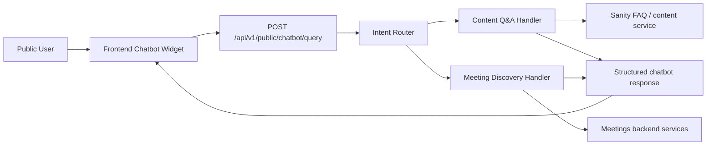

# SaudiNA Chatbot Architecture

## Purpose

SaudiNA chatbot provides two bounded public capabilities:

1. Content assistance / FAQ mode
2. Meeting discovery mode

The chatbot is an orchestration layer. It does not become a new source of truth.

- Content answers come from Sanity-managed CMS content
- Meeting discovery answers come from backend meeting APIs and services
- The chatbot must not bypass backend authorization, validation, or operational governance
- The design must stay extensible for later AI improvements without requiring a rewrite

## Core Principles

- Keep v1 deterministic and auditable
- Prefer backend-owned search and filtering over freeform AI answers
- Return structured responses, not only plain text
- Provide safe clarification when intent or filters are incomplete
- Avoid hallucinated guidance on recovery policy or meeting availability

## Target Architecture



## Modes

### 1. Content Assistance / FAQ Mode

Use this mode when the user is asking explanatory or support-content questions.

Examples:

- What is Narcotics Anonymous?
- How do I find a suitable meeting?
- Is it confidential?
- كيف أبدأ؟

Behavior:

- Retrieve answer candidates from CMS-managed FAQ content
- Return the strongest match with source attribution
- If confidence is low, return a safe fallback or clarification
- Do not generate unsupported advice from a general model in v1

### 2. Meeting Discovery Mode

Use this mode when the user is trying to find meetings conversationally.

Examples:

- Nearest meetings
- Meetings in Riyadh today
- Meetings near me
- Online meetings for women
- اجتماعات اليوم في الرياض

Behavior:

- Extract meeting filters from the message
- Call backend meeting search services
- Return structured meeting cards plus a short summary
- Ask clarifying questions when necessary, especially for near-me requests without location

## Intent Routing Model

Initial production model should be deterministic and rule-based.

Intents:

- `content_qna`
- `meeting_search`
- `clarification_needed`
- `fallback`

Recommended routing sequence:

1. Normalize the message and locale
2. Detect meeting language such as meeting, nearby, near me, today, online, Riyadh, اجتماع, قريب, اليوم
3. Extract explicit filters like city, weekday, online/in-person, language, gender
4. If meeting intent is high-confidence, route to meeting discovery
5. Otherwise, search CMS FAQ content
6. If neither path yields a reliable answer, return clarification or fallback

## Backend Integration Points

Single public chatbot endpoint:

- `POST /api/v1/public/chatbot/query`

Internal handler boundaries:

- `ChatbotService`
- `IntentRouter`
- `CmsFaqService`
- `MeetingsService`

Meeting discovery uses existing backend-owned services:

- `searchPublicMeetings`
- `searchNearbyMeetings`

CMS content Q&A uses Sanity-backed FAQ retrieval through the backend integration service.

## API Contract

### Request

```json
{
  "message": "Meetings in Riyadh today",
  "locale": "en",
  "city": "Riyadh",
  "areaId": null,
  "latitude": null,
  "longitude": null,
  "radiusKm": 10
}
```

### Response

```json
{
  "locale": "en",
  "type": "meeting-results",
  "intent": "meeting_search",
  "confidence": 0.92,
  "message": "I found 3 meetings in Riyadh today.",
  "clarificationNeeded": false,
  "filtersApplied": {
    "city": "Riyadh",
    "dayOfWeek": "tuesday"
  },
  "meetings": [],
  "sources": [],
  "followUpSuggestions": [
    "Show online meetings",
    "Show evening meetings"
  ]
}
```

### Response Types

- `faq`
- `meeting-results`
- `clarification`
- `fallback`

## Frontend Rendering Model

The widget should render structured assistant responses:

- message text
- FAQ/content source labels
- meeting result cards
- follow-up suggestion chips
- clarification prompts

The frontend should not try to infer business truth from raw text. It should render what the backend returns.

## Uncertainty And Fallback Handling

If CMS content is unavailable:

- return a safe fallback response
- do not invent unsupported answers

If meeting filters are insufficient:

- return `clarification`
- ask for city or location sharing

If no meetings are found:

- return `meeting-results` with zero items or `fallback`
- suggest nearby alternative filters

If backend integration fails:

- return a generic support-safe message
- log the failure for operations review

## Logging And Audit

Log on the backend:

- timestamp
- locale
- normalized intent
- confidence
- filters extracted
- result count
- FAQ source ids used
- failure category
- anonymous session identifier if available

Avoid storing sensitive personal disclosures or exact location history unless necessary.

## Minimal Safe Production Design

V1 should not depend on:

- general-purpose answer generation
- embeddings
- vector search
- autonomous tools

V1 should depend on:

- deterministic intent routing
- CMS-backed FAQ retrieval
- backend-governed meeting discovery
- structured response contracts
- auditable logs

## Future Extensibility

The architecture should support later improvements without changing public contracts:

- stronger multilingual intent classification
- better filter extraction
- RAG over curated CMS content
- smarter response composition

Future AI can help interpret and phrase responses, but it must not replace the backend as the source of truth for meetings or editorial content.

## Implementation Plan

1. Expand chatbot request and response contracts
2. Refactor backend chatbot into intent router plus handlers
3. Improve FAQ match scoring and source attribution
4. Add meeting filter extraction for city, weekday, online, language, and gender
5. Render structured responses in the frontend widget
6. Add operational logging and analytics hooks
