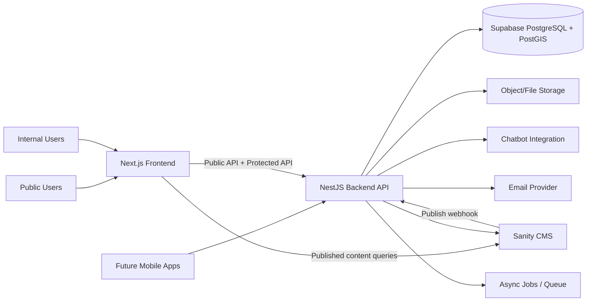
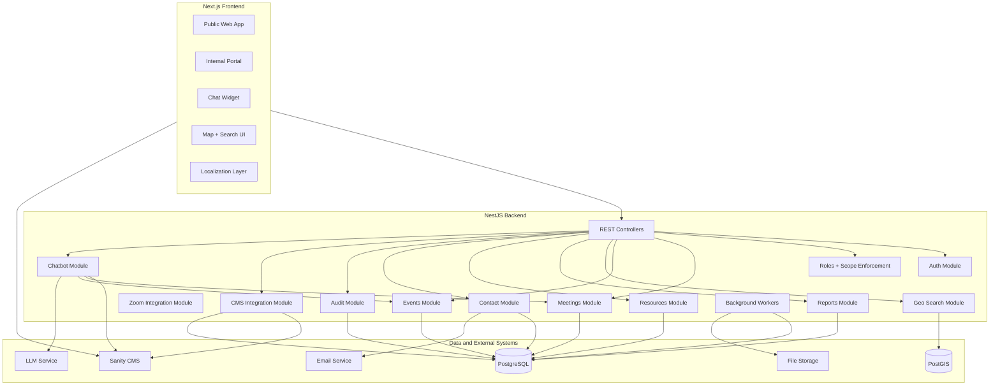
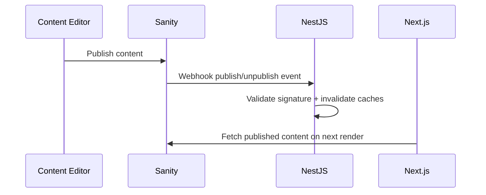
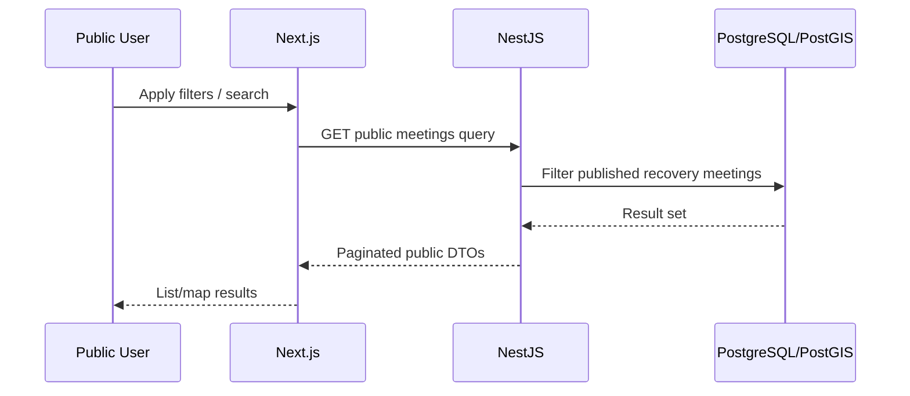
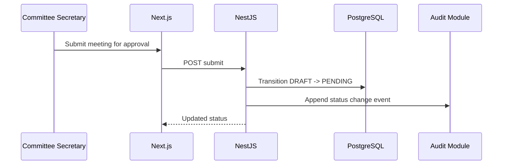
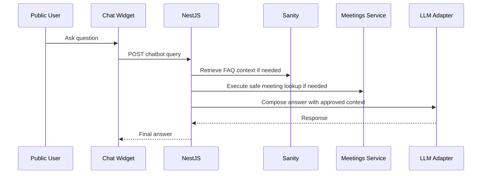
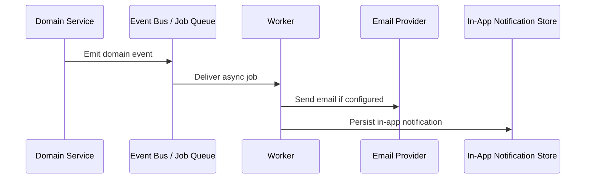
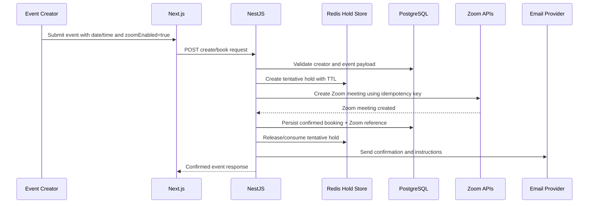
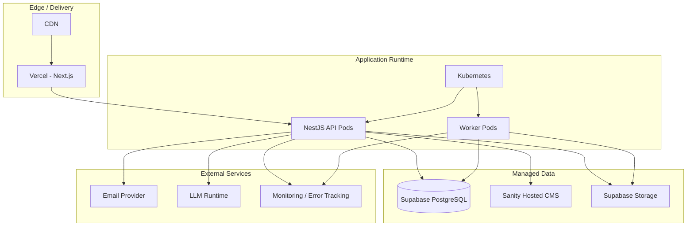

# SaudiNA Target Architecture

## 1. Purpose

SaudiNA is a multilingual public website and operational platform with two distinct operating surfaces:

- Public experience: CMS-driven content, recovery meeting discovery, maps, near-me search, resources, contact, chatbot.
- Internal operations: scoped administration, in-service meeting governance, event booking governance, reporting, and immutable audit.

Target stack:

- Frontend: Next.js
- Backend: NestJS
- Database: Supabase-managed PostgreSQL
- CMS: Sanity
- Geospatial: PostGIS
- Chatbot runtime: backend-integrated LLM adapter

Supabase is used strictly as managed PostgreSQL infrastructure. All business rules, orchestration, governance, and APIs live in NestJS.

---

## 2. High-Level Architecture

### Core boundary decisions

- Next.js owns rendering, UX, localization, SEO, map UI, and session-aware portal screens.
- NestJS owns all business logic, scope enforcement, workflow transitions, reporting, audit, chatbot orchestration, and integrations.
- PostgreSQL owns persistence, relational integrity, indexing, and PostGIS query execution.
- Sanity owns editorial content only.
- Chatbot integration is isolated behind backend adapters and never talks directly to the database from the browser.

---

## 3. System Boundaries

## 3.1 Frontend Boundary

Responsibilities:

- SSR/ISR public pages
- Locale routing and RTL/LTR layout
- Public search UI, filter UI, map UI, chatbot widget, contact form, public events page
- Internal portal UI for authorized users
- Access token/session handling
- Calling backend APIs and reading published CMS content

Must not own:

- Approval logic
- Scope decisions
- Audit decisions
- Report generation
- Direct database access

## 3.2 Backend Boundary

Responsibilities:

- REST API and versioned mobile-ready contract
- Authentication and authorization
- External identity provider federation
- Role and scope enforcement
- Meeting lifecycle logic
- Event lifecycle logic
- Public/private event visibility enforcement
- Zoom-enabled event booking orchestration
- Maker-checker controls
- Audit logging
- Report generation and exports
- Contact processing and email notifications
- CMS webhook handling and cache invalidation orchestration
- Chatbot retrieval/orchestration

## 3.3 Database Boundary

Responsibilities:

- Transactional persistence
- FK constraints and uniqueness
- Geospatial storage and indexing
- Read/write consistency for core operational data
- Immutable audit storage controls

Must not own:

- Approval workflow policy
- Access policy decisions beyond data-supporting constraints
- API logic
- CMS publishing workflow

## 3.4 CMS Boundary

Responsibilities:

- Bilingual editorial content
- FAQs, announcements, resource metadata, page content, media references
- Draft/publish lifecycle for content editors

Must not own:

- Meetings
- Governance workflows
- Internal operational state
- User management

## 3.5 Chatbot Boundary

Responsibilities:

- FAQ answering from Sanity-backed knowledge
- Recovery meeting discovery assistance via backend-approved search tools
- Locale-aware responses
- Fallback to contact flow

Must not own:

- Direct DB credentials in browser
- Approval, reporting, or admin capabilities
- Any write access except controlled feedback/session logging if later added

---

## 4. Architectural Principles

1. Backend-centric business logic.
2. Clear public/internal separation.
3. Domain-driven modularity in NestJS.
4. Scope-aware authorization at query and command level.
5. Immutable operational audit for every state-changing action.
6. CMS for content, not operations.
7. API-first contracts for future mobile clients.
8. Geospatial queries executed in PostGIS, not in application memory.
9. Asynchronous processing for heavy exports and notifications.
10. Least privilege across services and operators.

---

## 5. Non-Functional Requirements

### Availability

- Public website highly available with CDN-backed frontend delivery.
- Backend horizontally scalable behind load balancer.
- Database managed with automated backups and point-in-time recovery.

### Performance

- Public page first render optimized through SSR/ISR.
- Search and map queries indexed for low-latency filtered reads.
- Near-me queries use PostGIS GiST indexing.

### Security

- Protected APIs require authenticated sessions/tokens.
- Federated login is supported through external identity providers.
- Internal routes enforce both role and scope.
- Audit logs are append-only.
- Sensitive configuration and secrets kept outside codebase.

### Maintainability

- Each bounded context implemented as a dedicated NestJS module.
- DTO/contracts separated from persistence models.
- CMS schema and operational schema evolve independently.

### Observability

- Structured application logs.
- Request tracing and error monitoring.
- Correlation IDs propagated across requests and async jobs.
- Health and readiness endpoints exposed for runtime checks.
- Audit logs distinct from operational logs.

### Compliance and governance

- No silent workflow transitions.
- No privileged action without actor identity.
- No destructive mutation of audit data.

---

## 6. Logical Component Architecture

---

## 7. Domain Decomposition

## 7.1 Identity & Access

Owns:

- Users
- Roles
- Auth sessions/tokens
- Permission checks

Key rules:

- Multi-role users are supported.
- Global roles and scoped roles are evaluated together.
- Content editors are isolated from operational workflows.

## 7.2 User Assignments / Scope

Owns:

- User-to-region assignments
- User-to-area assignments
- User-to-committee assignments
- Scope inheritance rules

Key rules:

- Scope filtering is enforced in backend query composition.
- Super Admin bypasses scope restrictions.
- Parent scopes inherit child visibility.

## 7.3 Meetings

Owns:

- Recovery meetings
- In-service meetings
- Meeting status transitions
- Meeting validation rules

Key rules:

- `recovery_meetings` and `in_service_meetings` are separate tables.
- Recovery meetings are public only when `status = PUBLISHED`.
- In-service meetings are never public.

## 7.4 Events

Owns:

- Event records
- Public/private visibility
- Zoom-enabled booking lifecycle
- Publication eligibility
- Invitation-only/private access rules

Key rules:

- Events are separate from recovery meetings and must never share lifecycle state or API contracts.
- Events may be public or private.
- Zoom-enabled events use booking holds, idempotent booking, and confirmation notifications.
- Private events never enter public publication, SEO, chatbot, or public API projections.

## 7.5 Regions / Areas

Owns:

- Geographic hierarchy for operational scope and filters

Key rules:

- Internal reference data, not public content pages.
- Managed only through protected admin flows.

## 7.6 Committees

Owns:

- Committee definitions
- Regional or area nesting
- Manager/secretary assignment context

Key rules:

- One manager per committee.
- One or more secretaries per committee.

## 7.7 Reports

Owns:

- Report requests
- Report outputs
- Export lifecycle
- Ownership and visibility model

Key rules:

- Async generation.
- Creator plus parent managers can view, within scope.
- Audit trail extract restricted to Super Admin.
- Selected report types support approval-required workflows through configurable maker-checker policy.

## 7.8 Resources

Owns:

- Resource metadata
- Categories
- Download counters

Key rules:

- Public read access.
- Internal management by content/editorial roles.

## 7.9 Audit

Owns:

- Immutable audit entries
- Governance event history
- Access denied events

Key rules:

- Every state-changing write produces an audit record.
- Audit storage is append-only.

## 7.10 Contact

Owns:

- Contact submissions
- Support workflow status
- Notification triggers

Key rules:

- Public create.
- Protected read/manage.
- Rate limiting required.
- Access is granted to Super Admin and users with active assignment inside the `PR Committee`.

## 7.11 Chatbot

Owns:

- FAQ retrieval
- Meeting discovery dialogue
- Locale-aware prompt orchestration

Key rules:

- Read-only operational access.
- May only surface recovery meeting results from approved backend tools.

## 7.12 CMS Integration

Owns:

- Sanity webhook processing
- Content cache invalidation coordination
- CMS content projection if selective indexing is needed later

Key rules:

- CMS remains source of truth for editorial content.
- Operational data is never edited in CMS.

---

## 8. Public vs Protected API Boundaries

## 8.1 Public APIs

Examples:

- `GET /api/v1/public/meetings`
- `GET /api/v1/public/meetings/map`
- `GET /api/v1/public/meetings/nearby`
- `GET /api/v1/public/events`
- `GET /api/v1/public/events/:id`
- `GET /api/v1/public/resources`
- `POST /api/v1/public/contact`
- `POST /api/v1/public/chatbot/query`

Rules:

- No authentication required unless future personalization is added.
- Must expose only published/public-safe data.
- Must never reveal in-service meetings, private events, internal notes, audit data, or admin metadata.

## 8.2 Protected APIs

Examples:

- `POST /api/v1/admin/recovery-meetings`
- `POST /api/v1/admin/events`
- `PATCH /api/v1/admin/events/:id`
- `POST /api/v1/admin/events/:id/submit`
- `POST /api/v1/admin/events/:id/book-zoom`
- `POST /api/v1/admin/events/:id/publish`
- `POST /api/v1/admin/events/:id/unpublish`
- `POST /api/v1/admin/in-service-meetings`
- `POST /api/v1/admin/in-service-meetings/:id/submit`
- `POST /api/v1/admin/in-service-meetings/:id/approve`
- `POST /api/v1/admin/in-service-meetings/:id/reject`
- `GET /api/v1/admin/reports`
- `POST /api/v1/admin/reports`
- `GET /api/v1/admin/audit-logs`
- `POST /api/v1/admin/users/:id/assignments`

Rules:

- Auth required.
- Every endpoint enforces role and scope.
- Authorization is evaluated in this order: authentication validity, active role assignment, matching scope, allowed action, governance constraints.
- Every write endpoint emits audit events.
- Private event reads are protected and may only be exposed to explicitly authorized users or invitation flows.

---

## 9. Maker-Checker Governance Enforcement

Maker-checker applies to in-service meetings and to selected report workflows that are configured as approval-required.

### Workflow states

- `DRAFT`
- `PENDING`
- `APPROVED`
- `ARCHIVED`

### Enforcement model

1. Committee Secretary creates and edits draft.
2. Committee Secretary submits draft to pending.
3. Committee Manager of the same committee reviews.
4. Manager approves or rejects with mandatory comments.
5. Creator cannot approve their own record.
6. No bulk approval endpoint exists.

### Enforcement layers

- Controller guard: authenticated role check.
- Application service: validates transition legality.
- Scope service: verifies same committee or admin bypass.
- Persistence rule: stores approval actor, comments, and transition history.
- Audit module: records every transition.

### Recovery meeting governance

- Recovery meetings bypass approval entirely.
- Meeting Editor can publish/unpublish directly within assigned area.

### Report governance

- Reports default to async generation without approval unless the report type is marked as approval-required.
- For approval-required report types, creator and approver must differ.
- Report approval transitions are explicit workflow commands and are audit-logged.

### Event booking governance

- Events are governed through a separate booking lifecycle and are not recovery meetings.
- Zoom-enabled events require slot validation, tentative holds, and an idempotent booking call before confirmation.
- Private events may be booked, but they must never be published to public surfaces.
- Creator confirmation email is sent only after Zoom meeting creation succeeds and is committed durably.
- If publication is enabled for a public event, publication happens only after booking confirmation.

---

## 10. Audit Logging Strategy

## 10.1 What is audited

- Create/update/delete/archive actions
- Status changes
- Approve/reject events
- Contact status changes
- User assignment changes
- Failed access attempts
- Authentication events if required by policy

## 10.2 Audit data shape

Recommended fields:

- `id`
- `timestamp`
- `user_id`
- `user_role_snapshot`
- `action`
- `resource_type`
- `resource_id`
- `http_method`
- `path`
- `ip_address`
- `scope_context`
- `before_state`
- `after_state`
- `metadata`

## 10.3 Immutability strategy

- Separate `audit_logs` table.
- No update/delete API.
- Database trigger or rule rejects `UPDATE` and `DELETE` on `audit_logs`.
- Only append inserts are allowed from backend service account.

## 10.4 Operational vs audit logs

- Application logs: for debugging/observability.
- Audit logs: for governance, compliance, and traceability.

These are different stores with different retention and access rules.

## 10.5 Retention model

- Audit logs are retained long-term and treated as the highest-retention store.
- Operational logs follow environment-specific retention policies.
- Chatbot interaction logs, if retained, follow environment-specific retention configuration.
- Archival of operational records is configurable and must preserve audit referential integrity.

---

## 11. Geospatial Architecture

## 11.1 Storage model

- `recovery_meetings` stores `latitude`, `longitude`, and computed `location geography(Point, 4326)` or `geometry(Point, 4326)`.
- In-service meetings do not participate in public geo-discovery.

## 11.2 Query capabilities

- Bounding-box search for current map viewport
- Radius search for near-me
- Distance calculation for result display and sorting
- Filter combination with area, city, district, gender, day, language, online flag

## 11.3 Recommended PostGIS patterns

- `ST_MakePoint` + `ST_SetSRID` for point creation
- `ST_DWithin` for nearby queries
- `ST_Distance` for ordered proximity results
- spatial GiST index on `location`

## 11.4 Map behavior

- Public map queries only published recovery meetings with coordinates.
- Online-only meetings remain list-visible but are not map-pinned.
- Dense markers should be clustered in the frontend.

---

## 12. Integration Flows

## 12.1 CMS Publish Flow

## 12.2 Public Meeting Discovery Flow

## 12.3 In-Service Approval Flow

## 12.4 Chatbot Retrieval Flow

## 12.5 Eventing and Notification Flow

Supported event categories:

- CMS publish/unpublish
- In-service submit/approve/reject
- Report generated/ready/failed
- Contact submitted/status updated
- Event drafted/tentative/booked/confirmed/published/cancelled

## 12.6 Event Booking Flow

Rules:

- Tentative holds expire automatically.
- Duplicate booking attempts must resolve to the same Zoom meeting or a safe no-op.
- Confirmation email is sent only after Zoom success and durable persistence.
- Public publication eligibility is evaluated after confirmation, not before.

---

## 13. Security and Governance Principles

1. All internal writes go through NestJS.
2. Public clients never connect directly to PostgreSQL.
3. Sanity tokens are server-side for privileged CMS operations.
4. Protected APIs enforce both authentication and scope.
5. Approval decisions are explicit command endpoints, not generic patch semantics.
6. Audit is append-only and privileged to read.
7. Sensitive actions require durable actor identity.
8. Email/chatbot integrations are isolated behind adapters.
9. Principle of least privilege across service credentials.

### Authentication and identity providers

- Browser and mobile access use token-based authentication.
- External identity federation supports Zoho and Google OAuth.
- Provider normalization happens in the auth module so downstream authorization remains provider-agnostic.
- Internal authorization always operates on local user, role, and assignment records after identity resolution.

---

## 14. Future Mobile Readiness

The backend must be treated as the canonical product API from day one.

### Readiness requirements

- Versioned REST endpoints under `/api/v1`
- Stable DTOs independent of Next.js page structure
- Token/session strategy suitable for browser and mobile clients
- No frontend-only business logic
- Upload/export flows exposed through backend contracts
- Locale-aware API behavior via header or explicit locale parameter
- Standard error model and pagination contract applied consistently across endpoints

### Mobile scope impact

- Public features can later power native meeting discovery apps.
- Internal operational features can later power committee/manager workflows.
- Chatbot remains backend-mediated for both web and mobile.

---

## 15. Deployment-Level View

### Recommended deployment split

- Next.js on Vercel for global rendering and CDN delivery.
- NestJS API and workers on Kubernetes for operational control and background jobs.
- Supabase for managed PostgreSQL only.
- Supabase Storage for file/object storage with public/private bucket separation.
- Sanity hosted separately as editorial platform.

### Environments and configuration

- Local, Dev, Staging, and Production environments are isolated.
- Configuration is environment-based and injected externally.
- Secrets are managed outside the repository and never hardcoded.
- Health, observability, and rate-limit settings are environment-tunable.

---

## 16. Data Ownership Summary

| System | Owns |
|--------|------|
| Next.js | UI composition, rendering, localization state |
| NestJS | Business logic, APIs, governance, integrations |
| PostgreSQL | Operational records, relationships, audit, reporting data |
| PostGIS | Spatial indexing and geo-query execution |
| Sanity | Editorial/public content |
| Supabase Storage | Managed file/object storage with access policies |
| Events domain projections | Public/private event publication state and Zoom booking records |
| Chatbot adapter | Response orchestration using approved sources |

---

## 17. Key Design Decisions

1. Separate tables for recovery and in-service meetings.
2. Public and protected API namespaces are explicitly separate.
3. Scope enforcement happens in backend services and query builders, not just in UI guards.
4. Audit is immutable at the database level.
5. Geospatial logic is delegated to PostGIS.
6. CMS content remains outside the operational database except optional mirrored indexes.
7. Supabase is infrastructure only, not auth/business workflow runtime.
8. Chatbot uses backend-approved retrieval, never direct client-side retrieval.
9. File storage uses Supabase Storage with bucket-level access policy separation.
10. Events are modelled separately from recovery meetings and have their own publication and Zoom workflow.
11. Authentication uses federated identity providers, while authorization remains local to SaudiNA domain data.

---

## 18. Risks and Mitigations

| Risk | Impact | Mitigation |
|------|--------|------------|
| Scope leaks in internal queries | High | Centralized scope policy layer and mandatory query helpers |
| Generic CRUD bypassing workflow rules | High | Explicit command endpoints for transitions |
| Audit volume growth | Medium | Partitioning/archive strategy while preserving immutability |
| CMS schema drift | Medium | Versioned content schemas and webhook contract tests |
| Slow geo queries at scale | Medium | GiST indexes, bounded result sets, viewport queries |
| Chatbot hallucinating unsupported answers | Medium | Retrieval-constrained prompting and fallback to contact |
| Report generation load spikes | Medium | Async workers and export object storage |
| Treating Supabase features as app logic later | Medium | Maintain policy: all business logic remains in NestJS |
| Identity provider drift or provider-specific logic leakage | Medium | Normalize identities in auth module and keep providers behind adapters |
| Contact access ambiguity across roles and committees | Medium | Enforce explicit PR Committee assignment checks in policy layer |
| Private events leaking into public surfaces | High | Separate public event projections, explicit privacy filters, and chatbot/public API whitelists |
| Zoom booking duplication or race conditions | High | Redis tentative holds, idempotency keys, and Zoom reconciliation jobs |

---

## 19. Caching, Rate Limits, and Storage

### Caching and performance

- Public CMS content should be cached at the frontend/edge with explicit invalidation on Sanity webhook events.
- Public meeting search responses may use short-lived cache only for anonymous GET requests where freshness tolerance is acceptable.
- Public event search and page rendering should use only published public event projections.
- Protected operational APIs should prefer correctness over aggressive caching.
- Report generation stays async and writes artifacts to storage when complete.

### Rate limiting and abuse protection

- Public search endpoints: `60/minute` per client identity.
- Chatbot endpoints: `20/minute` per client identity.
- Contact submission endpoint: `3/hour` per IP.
- Breaches return `429 Too Many Requests` with a standard error model.

### File storage strategy

- Use Supabase Storage for binary objects.
- Public bucket patterns: downloadable public resources and approved public assets.
- Private bucket patterns: generated report exports, internal-only attachments, protected documents.
- Path conventions should be domain-based, for example: `resources/`, `reports/`, `content/`.

---

## 20. Notifications

- Notifications are asynchronous.
- Delivery channels include email and in-app notifications.
- Notification emission is driven by domain events rather than inline controller logic.
- Initial triggers include contact submission, in-service approval actions, and report completion.
- Event notifications include booking confirmation, booking failure, hold expiry, cancellation, and publication status changes.

---

## 21. Implementation Guidance

Recommended NestJS module map:

- `auth`
- `identity-access`
- `scope-assignments`
- `regions-areas`
- `committees`
- `recovery-meetings`
- `in-service-meetings`
- `meeting-discovery`
- `geo-search`
- `resources`
- `contact`
- `reports`
- `audit`
- `cms-integration`
- `chatbot`
- `notifications`
- `health-observability`
- `file-storage`
- `eventing`

Recommended database aggregates:

- identity tables
- scope assignment tables
- `recovery_meetings`
- `in_service_meetings`
- committee tables
- resources tables
- contact tables
- reports tables
- `audit_logs`

Recommended supporting technical capabilities:

- auth provider adapters for Zoho and Google OAuth
- standardized API error contract
- `/health` endpoint and readiness probes
- correlation ID middleware/interceptor
- centralized rate-limit policies for public endpoints

This architecture preserves a clean separation between public content delivery, governed operations, and future client expansion.
